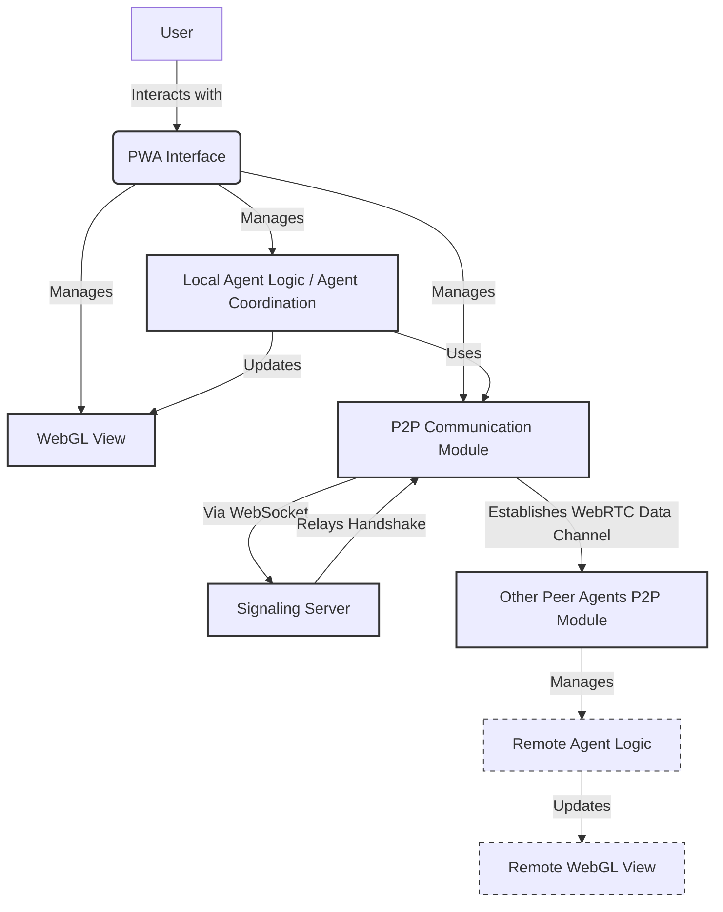

# Distributed LLM Agent System

## Idea and Objective

This project aims to explore the development of a distributed system composed of Large Language Model (LLM) agents. The core idea is to enable these agents to collaborate on complex tasks in a decentralized manner.

The coordination style is inspired by SETI@home, envisioning a future where agents can be discovered and can contribute processing power peer-to-peer. In its current implementation, the peer discovery and signaling aspects are simplified, relying on manual SDP exchange for establishing WebRTC connections.

Key technology choices include:
-   **Progressive Web Applications (PWAs):** Used for the agent frontends, providing a user interface to interact with and monitor individual agents or the system.
-   **WebGL (via Three.js):** Employed for visualizing agent activity, their status (idle, busy, waiting), and potentially their interactions or data flows in a 3D space.
-   **WebRTC (Peer-to-Peer):** Facilitates direct communication (data channels) between agents, enabling them to exchange information, assign tasks, and report results without a central server for these interactions (once connected).

Task processing within this system is designed for asynchronous operations that might require significant processing time, akin to "deep thinking" tasks. Results from these tasks are stored by the completing agent and can be reported back to the assigning agent. The framework supports querying these results locally for now.

**Current Stage:** This repository represents the foundational framework for such a system. It includes the basic components for PWA setup, WebRTC communication, agent representation, task assignment, asynchronous processing simulation, and WebGL visualization. Further development would focus on robust peer discovery, advanced task decomposition, sophisticated agent capabilities, and more complex interaction protocols.

## Project Structure

The project is organized into the following main directories:

-   **`pwa/`**: Contains all files related to the Progressive Web Application. This includes:
    -   `index.html`: The main entry point for the application.
    -   `service-worker.js`: Handles PWA lifecycle events like caching.
    -   `manifest.json`: Provides PWA metadata.
    -   JavaScript for UI interactions and integrating other components (like WebGL and P2P).
    -   `icons/`: Icons for the PWA.

-   **`webgl/`**: Houses the WebGL visualization code.
    -   `main.js`: Script for setting up and managing the Three.js scene, rendering agents, and updating their visual states based on information from the agent coordination module.

-   **`shared/`**: Includes common JavaScript modules used by both the PWA and potentially other parts of the system.
    -   `p2p.js`: Manages WebRTC peer-to-peer connections, data channel setup, and interacts with the signaling server for connection establishment (offer/answer/ICE candidate exchange).
    -   `agent-coordination.js`: Defines the `Agent` class, task structures, and logic for task assignment, processing (simulated), and status updates. It interacts with `p2p.js` for communication and `webgl/main.js` for visual updates.

-   **`server/`**: Contains the Node.js-based WebSocket signaling server.
    -   `signaling-server.js`: The script that facilitates peer discovery and WebRTC handshake message relay between clients.
    -   `package.json`: Defines dependencies (like `ws` for WebSockets, `uuid` for client IDs) and start scripts for the server.
    This server is essential for the automated P2P connection process.

## Build Instructions

### Prerequisites

To run this project, you primarily need a modern web browser that supports the following web technologies:

-   **WebGL:** For rendering the 3D agent visualizations.
-   **WebRTC:** For enabling peer-to-peer communication between agents.
-   **Service Workers:** For Progressive Web App (PWA) features like offline capabilities (though offline caching is minimal currently) and installability.

Most up-to-date versions of browsers like Google Chrome, Mozilla Firefox, Microsoft Edge, and Safari should be compatible.

**No JavaScript Build Tools Required:**
Currently, the project does not rely on any specific JavaScript build tools (e.g., Webpack, Rollup, Parcel) or package managers (like npm or yarn) for its basic operation. The JavaScript files are vanilla ES6 and are linked directly in the HTML.

### Build Steps

**No Explicit Build Process Needed.**

At this stage, the project is designed to be run directly from the source files. There is no compilation, transpilation, or bundling step required.

Simply serve the project files using a local web server (see 'Running the Project' section) and open the `pwa/index.html` file in your browser.

## Running the Project (Deployment)

The project consists of two main parts that need to be running: the PWA (client-side) and the Signaling Server (server-side).

### 1. Start the Signaling Server

The signaling server is crucial for clients (agents) to discover each other and exchange messages needed to establish direct WebRTC P2P connections.

-   **Navigate to the server directory:**
    ```bash
    cd server
    ```
-   **Install dependencies (if you haven't already):**
    ```bash
    npm install
    ```
-   **Start the server:**
    ```bash
    npm start
    ```
    This will typically run `node signaling-server.js`. You should see a log message like "Signaling server started on ws://localhost:8080". Keep this terminal window open.

### 2. Serving the PWA Application

To run the PWA and utilize its features (like service workers), you need to serve its files via an HTTP server. Opening `pwa/index.html` directly from the local filesystem (e.g., using a `file:///` URL) will not work correctly.

A simple local HTTP server is sufficient. Start this from the **project root directory** in a separate terminal window:

1.  **Using Python:**
    *   If you have Python 3 installed:
        ```bash
        python -m http.server 8000
        ```
    *   If you have Python 2 installed:
        ```bash
        python -m SimpleHTTPServer 8000
        ```

2.  **Using Node.js (with `http-server`):**
    *   If you have Node.js and npm installed, you can use `npx` to run `http-server` without installing it globally:
        ```bash
        npx http-server . -p 8000
        ```
    *   Alternatively, you can install it globally first (`npm install -g http-server`) and then run:
        ```bash
        http-server . -p 8000
        ```

3.  **Other Simple Servers:**
    *   Many other tools can serve static files, such as `live-server` for Visual Studio Code, or extensions for your preferred browser or IDE. Any server that can serve static files from the project root will work.

### Accessing the Application

Once your local HTTP server is running (e.g., on port 8000), open your web browser and navigate to:

`http://localhost:8000/pwa/index.html` (if your HTTP server for the PWA is on port 8000).

This will load the PWA. Ensure the signaling server is running first.

## Usage Instructions

With the signaling server running and the PWA served via HTTP, you can test the system:

1.  **Opening the Application for Two Peers:**
    *   Open the PWA (e.g., `http://localhost:8000/pwa/index.html`) in two separate browser windows or tabs. These will act as two distinct peers/agents.

2.  **Connect to Signaling Server:**
    *   In **both windows**, click the "Connect to Signaling Server" button.
    *   Observe the "Signaling Status" change to "Connected" and your unique "My Client ID" displayed.

3.  **Discover and Connect to Peers:**
    *   In **Window 1**, click the "Discover Peers" button.
    *   The "Available Peers" list should populate, showing the Client ID of the agent in Window 2.
    *   In **Window 1**, click the "Connect" button next to the peer ID listed (which corresponds to Window 2).
    *   The connection process (offer, answer, ICE candidates) will now happen automatically via the signaling server.
    *   **Observe in both windows:**
        *   The "P2P Connections" status should update, eventually indicating "connected" for that peer.
        *   WebGL agent representations may appear or update based on successful P2P connection and data channel establishment.

4.  **Assigning a Test Task:**
    *   Once a P2P connection is established between the two peers (e.g., Window 1 is connected to Window 2):
        *   In **Window 1**, select the Client ID of Window 2 from the "Target Peer for Task" dropdown.
        *   Click the "Assign Task to Selected Peer" button.
    *   Alternatively, in either window, click "Assign Task Locally" to have the local agent process a task for itself.
    *   **Observe:**
        *   The status of the assigning agent (in its UI and WebGL representation) should change to "waiting_for_completion" (orange cube).
        *   The status of the receiving agent (in its UI and WebGL representation) should change to "busy" (red cube) while it simulates processing.
        *   After a few seconds, the receiving agent completes the task, its status returns to "idle" (blue cube), and it sends a completion message back.
        *   The assigning agent then also returns to "idle" (blue cube).

5.  **Viewing Task Results:**
    *   The "Completed Task Results" list in the UI of the **assigning agent's window** should update when the remote agent reports task completion.
    *   If a task was assigned locally, the list in that agent's window will update once it processes it.
    *   (The "View Local Completed Tasks" button was removed in favor of the live-updating list, but similar functionality to inspect an agent's full task history could be re-added).

6.  **WebGL Visualization:**
    *   The 3D canvas displays cubes that represent the agents in the system.
    *   **Colors indicate agent status:**
        *   **Blue:** Idle (available for tasks).
        *   **Red:** Busy (currently processing a task).
        *   **Orange:** Waiting for completion (has assigned a task and is waiting for the result).
        *   **Grey:** Default or unknown state (e.g., before full initialization or if an agent is discovered but status is not yet set).
    *   A green wireframe cube is also present for basic scene reference.

These steps allow you to test the core functionalities: P2P connection, task assignment across peers, asynchronous task simulation, result notification, and visual status updates.

## Diagrams

This section provides visual representations of the system architecture and key interaction flows.

### System Architecture



**Diagram Legend:**
-   **User:** The human operator.
-   **PWA Interface:** The main application interface in the browser.
-   **WebGL View:** Renders agent visuals.
-   **Local Agent Logic / Agent Coordination:** Manages tasks and agent state for the local instance.
-   **P2P Communication Module:** Handles WebRTC connections and signaling server interaction.
-   **Signaling Server:** Node.js WebSocket server facilitating peer discovery and WebRTC handshake.
-   **Other Peer Agents P2P Module:** The P2P module in another browser instance.
-   **Remote Agent Logic / Remote WebGL View:** Represents the agent logic and view in the peer's browser.


### Task Assignment Flow

This sequence diagram illustrates the process of one agent assigning a task to another using the signaling server for initial P2P setup. (The P2P connection is assumed to be established before this flow begins).

```mermaid
sequenceDiagram
    participant User
    participant Browser1_PWA [Browser 1: PWA - Agent A Assigner]
    participant AgentCoord_A [Browser 1: Agent Logic - Agent A]
    participant WebGL_A [Browser 1: WebGL View]

    participant Browser2_PWA [Browser 2: PWA - Agent B Processor]
    participant AgentCoord_B [Browser 2: Agent Logic - Agent B]
    participant WebGL_B [Browser 2: WebGL View]

    Note over Browser1_PWA, Browser2_PWA: P2P Data Channel already established via Signaling Server.

    User->>Browser1_PWA: Selects Peer B, Clicks "Assign Task"
    Browser1_PWA->>AgentCoord_A: initiateTaskAssignment(AgentA, PeerB_ID, "Process data")
    AgentCoord_A->>AgentCoord_A: Create Task_XYZ (assignerId=A)
    AgentCoord_A->>AgentCoord_A: Set Agent A status: 'waiting_for_completion'
    AgentCoord_A->>WebGL_A: updateAgentRepresentation(A, 'waiting_for_completion')

    Note over AgentCoord_A, AgentCoord_B: Agent A sends 'taskAssignment' (Task_XYZ)\nvia P2P Data Channel to Agent B.
    AgentCoord_A-->>AgentCoord_B: DC Msg: {type: 'taskAssignment', task: Task_XYZ}

    AgentCoord_B->>AgentCoord_B: Receive task, Set Agent B status: 'busy'
    AgentCoord_B->>WebGL_B: updateAgentRepresentation(B, 'busy')
    AgentCoord_B->>AgentCoord_B: Simulate async work for Task_XYZ

    Note right of AgentCoord_B: Agent B processes task...

    AgentCoord_B->>AgentCoord_B: Task_XYZ completed, result: "Done"
    AgentCoord_B->>AgentCoord_B: Set Agent B status: 'idle'
    AgentCoord_B->>WebGL_B: updateAgentRepresentation(B, 'idle')

    Note over AgentCoord_B, AgentCoord_A: Agent B sends 'taskCompleted' (Task_XYZ, result)\nvia P2P Data Channel to Agent A.
    AgentCoord_B-->>AgentCoord_A: DC Msg: {type: 'taskCompleted', taskId: XYZ, result: "Done"}

    AgentCoord_A->>AgentCoord_A: Receive completion, Update Task_XYZ
    AgentCoord_A->>AgentCoord_A: Set Agent A status: 'idle'
    AgentCoord_A->>WebGL_A: updateAgentRepresentation(A, 'idle')
    AgentCoord_A->>Browser1_PWA: Update UI with task result
```

## Future Work / Roadmap

This project lays a basic foundation. Many exciting enhancements and features can be added:

-   **Signaling Server Implementation:**
    -   Develop a robust signaling server (e.g., using WebSockets) to automate the WebRTC handshake. This will eliminate the current manual copy-pasting of SDP offers/answers, making P2P connections seamless.

-   **Actual LLM Integration:**
    -   Integrate real Large Language Model processing capabilities into the agents. This is a core next step and could involve:
        -   Using client-side LLM libraries (e.g., TensorFlow.js, ONNX.js for smaller models).
        -   Making API calls from agents to backend LLM services.
        -   Defining more complex and meaningful task types that leverage LLM strengths (e.g., text generation, analysis, summarization, sub-problem solving).

-   **Dynamic Peer Discovery:**
    -   Implement mechanisms for agents to dynamically discover each other on the network (e.g., using mDNS, a shared discovery server, or network broadcasts if feasible within browser/network constraints).

-   **Advanced Task Orchestration & Management:**
    -   Develop more sophisticated strategies for task decomposition, distribution among available agents, and load balancing.
    -   Implement fault tolerance mechanisms (e.g., task reassignment if an agent disconnects).
    -   Allow for multi-step tasks or task dependencies.

-   **Persistent and Shared Storage:**
    -   Explore robust client-side storage for task results and agent state (e.g., IndexedDB).
    -   For more durable or shared knowledge, consider integrating with a server-side database or distributed storage solutions.

-   **Enhanced WebGL Visualization:**
    -   Add more detailed visual representations of agents and their current tasks.
    -   Visualize data flow, communication links between agents, and task progress more explicitly.
    -   Introduce interactive elements within the WebGL scene.

-   **Security Considerations:**
    -   Thoroughly address security aspects, especially for P2P communication (e.g., data encryption, peer authentication/authorization).
    -   Consider privacy implications if agents handle sensitive data.

-   **UI/UX Improvements:**
    -   Enhance the overall user interface for better clarity, ease of use, and more comprehensive monitoring and control features.
    -   Improve the PWA experience (e.g., more offline content, better install prompts).

-   **Code Refinement and Modularity:**
    -   Refactor and further modularize the codebase for better maintainability and scalability.
    -   Add comprehensive unit and integration tests.
